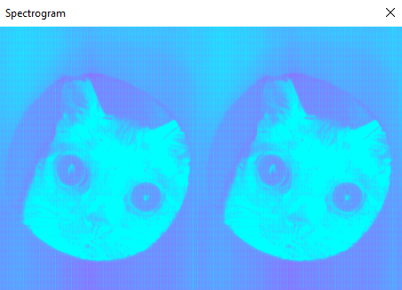

# spectrogramma
using iFFT, generates audio files with pictures hidden inside >:)

*(output from foobar2000's spectrogram visualizer -- picture from @bigfootjinx on instagram)*

## Usage
The executable expects three arguments:
- the input image
- the path for the outputted file (.wav)
- the number of samples in the file (44.1 kHZ, so divide this by 44100 to get the length of the resulting file in seconds)

additionally, you can change the DFT size by appending an additional argument, which must be a power of 2 -- behavior is undefined otherwise.

## Build
The CMakeLists.txt file relies on the following libraries:

- [glm](https://github.com/g-truc/glm)
- [AudioFile](https://github.com/adamstark/AudioFile)
- [stb](https://github.com/nothings/stb)
- [GTest (for testing :D)](https://github.com/google/googletest)

Ensure these libraries are installed on your system via your package manager of choice before building.